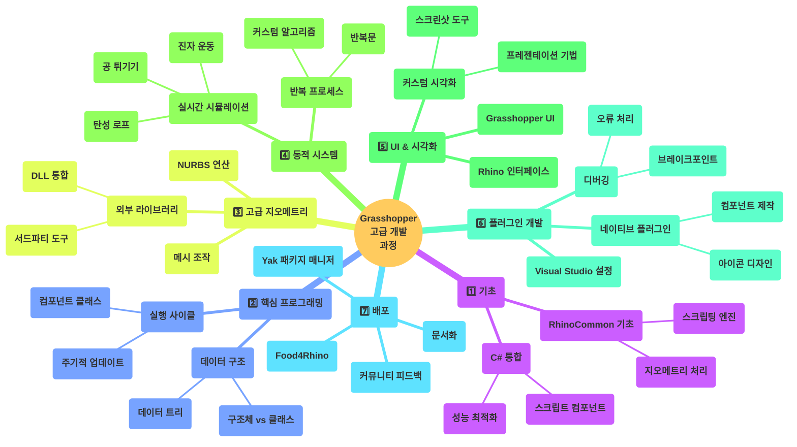
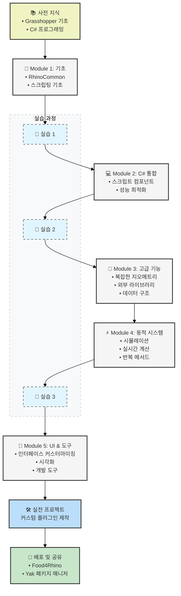

## Advanced Development in Grasshopper

### 1. 목표
- 기본적인 Grasshopper 사용법을 넘어선 고급 개발 기술
- 스크립팅과 플러그인 개발을 통한 Grasshopper의 심화 활용법
- C# 및 Python 스크립팅을 통한 커스터마이징 방법

### 2. 커리큘럼 주요 내용
- RhinoCommon 소개와 Grasshopper/Rhino의 스크립팅 엔진 활용
- C# 스크립트 컴포넌트를 통한 알고리즘 구현
- Advanced Geometry 작업과 외부 라이브러리 활용
- 동적 시뮬레이션 구현 (예: 진자, 탄성 로프, 공 튀기기)
- Rhino와 Grasshopper UI 조작 방법
- 플러그인 개발 및 배포 방법 (Food4Rhino, Yak 패키지 매니저)

### 3. 전제 조건
- 기본적인 Grasshopper 사용법 숙지 필요
- C# 프로그래밍 언어에 대한 이해 필요

### 4. 과정 특징
- 순차적으로 구성된 강의와 실습 혼합
- 2023년 초 기준 Rhino 7 or 8 과 Grasshopper 1 버전 사용
- 실제 플러그인 개발 프로젝트 포함

### 5. 권장사항
- 순차적인 학습 진행
- 실습 과정 참여

### A. 과정에 대한 아이디어 그래프

### B. 커리큐럼
